# Core Fundamental Project

## Brief

For this project, I have been tasked "To create a CRUD application with utilisation of supporting tools,
methodologies and technologies that encapsulate all core modules
covered during training."

Basically, we must create an application that allows the user to Create some data, Read some data, Update some data and Delete some data. It will utilise and show a lot of what I have learnt over the past several weeks.

### Addition Requirements
* A Trello board containing user stories
* A relational database which consists of at least two tables which have one-to-many relationships
* Clear and thorough documentation on the design phase, app architecture and risk assessment
* A functional application which has been created using python and adheres to the best practices and design principles
* Create test suites to thoroughly test the application. They will include automated tests for validation of the application
* A website with a clear UI which will be created using Flask
* Code fully integrated into a Version Control System using the Feature-Branch model which will subsequently be built through a CI server and deployed to a cloud-based virtual machine.

### My Approach
To acheive this, I have decided to create an application that will display jobs but I will focus on the intended user being a plumber.
The app will allow the user to do the following:
* Create a customer record
  * First name
  * Last name
  * Email
  * Numbers (home and mobile)
  * Address (street, town/city, county, postcode)
* Create a task (i.e. what the job entails) record
  * Description
  * Estmated time to complete task/job
  * Estimated Costs (labour costs and how much you charge per hour)
* Create a job record
  * Customer (id from customer table)
  * Task (id from task table)
  * Total price
  * Start Date
  * End Date
* Create a materials record
  * Name
  * Description
  * Supplier
  * Price
* Create a materials used record (i.e. what materials are used on a job)
  * Job and materials (id from respective tables)
  * Quantity

* View and update records from each table
* Delete a record from any of the tables.
* Additionally, when a record is deleted all records that are linked to that record via foreign key will get deleted. For example, if a Job record was deleted all of the records in the Materials Used table with the same id as the job getting deleted will also be deleted.
* Also, the user should only have to input and edit the price for the materials and task price per hour. The app will calculate the total cost of the job.

## Architecture

### Database Structure

Below is my Entity Relationship Diagram(ERD) which shows the structure of my database. I have also included my original ERD shows the changes I made to whilst I was developing the app. 

Original ERD:
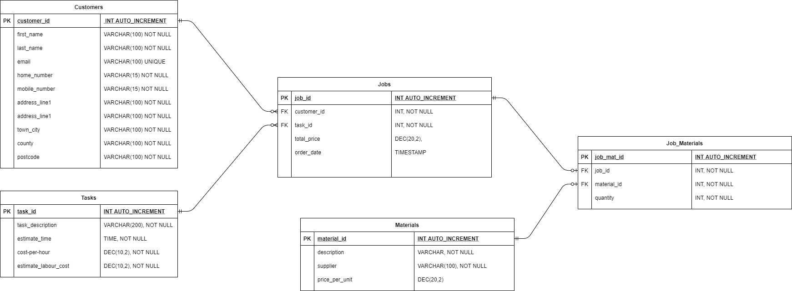

Current Working ERD:
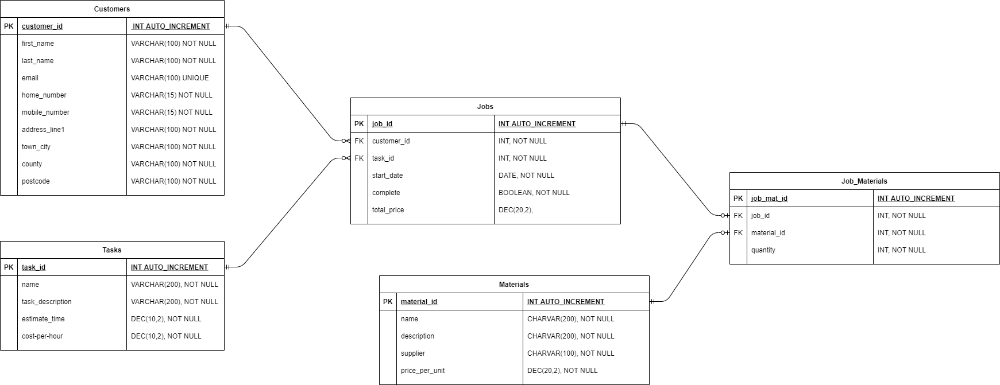

As you can see there is not much change but I thought I was worth including.

## Risk Assessment

## CI Pipeline

For this project we used what is called a CI Pipeline. A CI Pipeline allows for continous integration/delivery. In my case, I will develop code on my local machine which will then be pushed to my code repository which will then be automatically pushed to my CI sever with the use of a webhook to be then automatically installed on a VM.

For the CI Pipeline I will use:
* Code Development: Python
* Code Repository: GitHub
* Project Tracking: Trello
* Unit Testing: Pytest
* CI Server: Jenkins
* Virtual Machine(VM): Google Cloud Platform(GCP)

I also hosted my SQL server on GCP.

Once I have a working and stable version of the app, the app is going to be deployed by gunicorn. Gunicorn is a python web server gateway interface which splits the VM's resources equally which are known as 'workers'. When a user wishes to connect the server, gunicorn assigns a 'worker' to that connection giving them dedicated resources allowing the server to run smoother for all user.

## Front-end Design

Below is going to be all of the pages for my application. They were all created using simple HTML and Jinja2 and are all a simple design with not much CSS(styling) done.

When the user navigates to the url, they will be taking to the home(index) page. They will see all the links for adding and viewing records. If there is no jobs found the page will prompt you to create one.

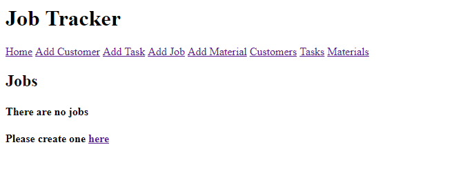

Once a job is created it will be displayed on the home page. The price will automatically be calculated when the job is created and when any materials have been added to the job.

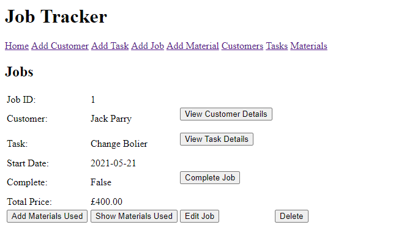

Clicking the 'Add Customer' link/button at the top of any page will take you to the Add Customer page as seen below, where you can add a new customer.

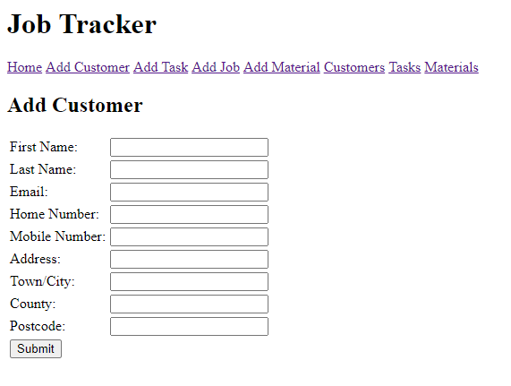

Clicking the 'Add Task' link/button at the top of any page will take you to the Add Task page as shown below, where you can add a new task.

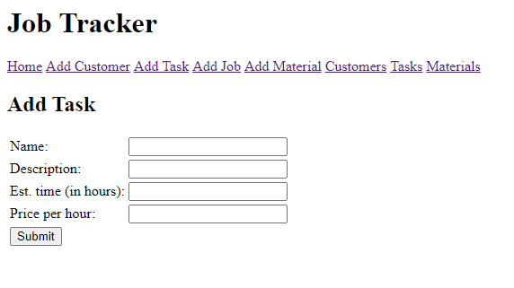

Clicking the 'Add Material' link/button at the top of any page will take you to the Add Material page as shown below, where you can add a new material.

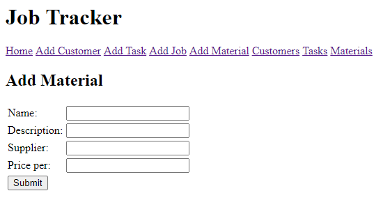

Clicking the 'Add Job' link/button at the top of any page, or on the home page when there are no jobs, will take you to the Add Job page, as shown below, where you can add a new job. The user will select a customer and task from drop down lists. Also, the current date is displayed in the start date input box.

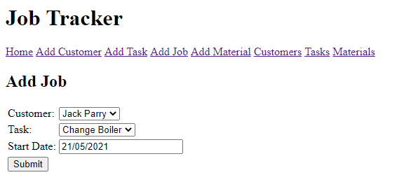

Clicking the 'Add Materials Used' link/button under a job will take you to the Add Materials Used page, as shown below, where you can add a material to a job. The user will select a material from a drop down list and input the quantity they want to add.

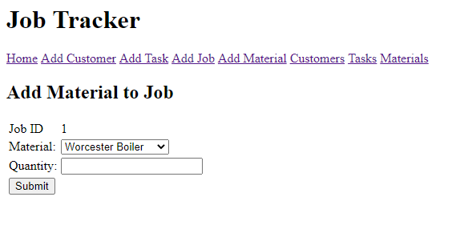

Clicking the 'Customers' link/button, or clicking submit to create a new customer, will take you to a page which displays all of the customers in the database, as shown below. From there you can edit or delete the customers information.

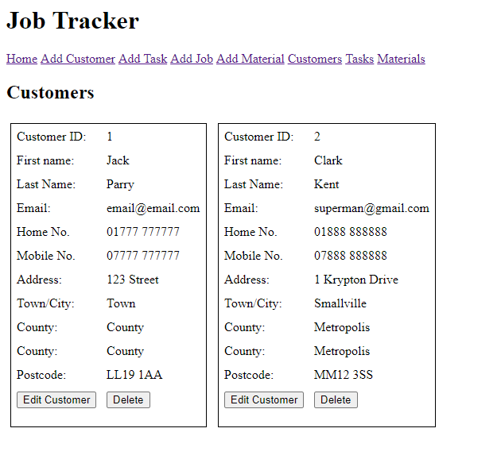

Clicking the 'Tasks' link/button, or clicking submit to create a new task, will take you to a page which displays all of the tasks in the database, as shown below. From there you can edit or delete the tasks information.

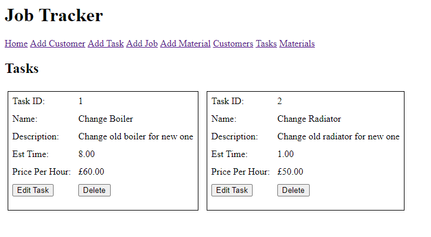

Clicking the 'Materials' link/button, or clicking submit to create a new material, will take you to a page which displays all of the tasks in the database, as shown below. From there you can edit or delete the materials information.

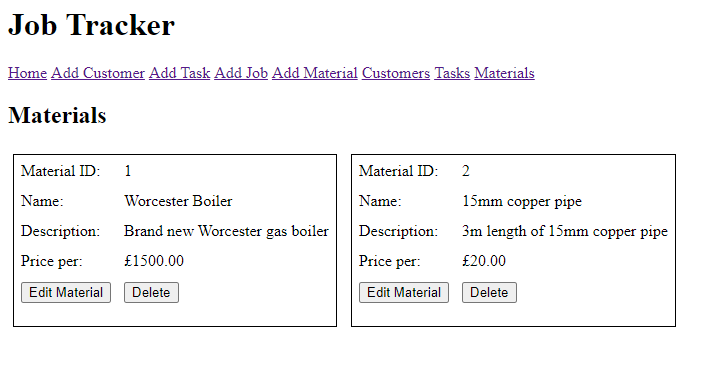

Clicking the 'Show Materials Used' button under a job on the home page will take you to a page which displays all of the materials used for a chosen job, as shown below. From there you can edit or delete what materials are used for the job.

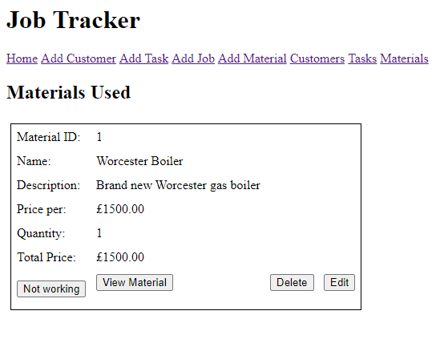

Clicking the 'Edit Customer' button under a customer on the Customers Page will take you to a page which will allow the user to edit(update) a customers information, as shown below. Clicking the submit button on that page will take you back to the customers page. For some reason the 'not working' will not work not matter what I call from it.

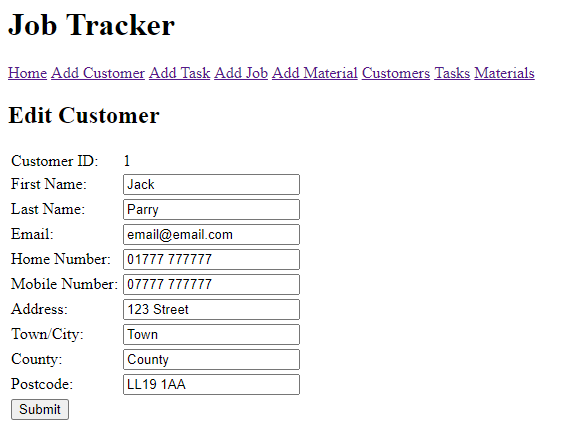

Clicking the 'Edit Task' button under a task on the Tasks Page will take you to a page which will allow the user to edit(update) a tasks information, as shown below. Clicking the submit button on that page will take you back to the Tasks page.

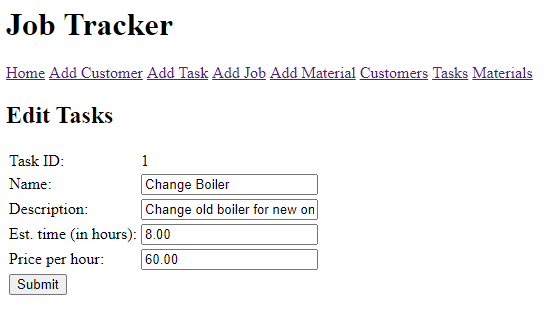

Clicking the 'Edit Material' button under a material on the Materials Page will take you to a page which will allow the user to edit(update) a materials information, as shown below. Clicking the submit button on that page will take you back to the Materials page.

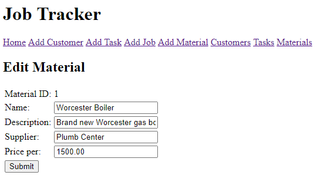

Clicking the 'View Customer Details' button next to customer in a job on the home page will take you to a page which will display the chosen customers information, as shown below. The user can edit and delete from this screen.

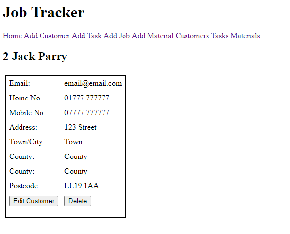

Clicking the 'View Task Details' button next to task in a job on the home page will take you to a page which will display the chosen tasks information, as shown below. The user can edit and delete from this screen.

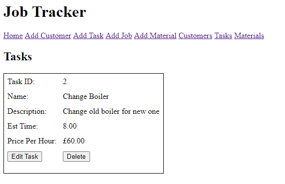

Clicking the 'View Material' button under material on the materials used page will take you to a page which will display the chosen materials information, as shown below. The user can edit and delete from this screen.

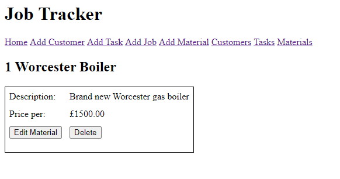

The delete buttons call a function that deletes the selected data from the database and then redirect you back to where you were.

## Testing

Coverage report:

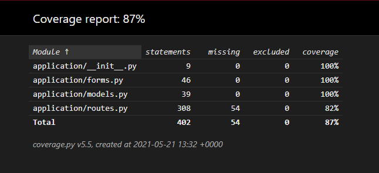
